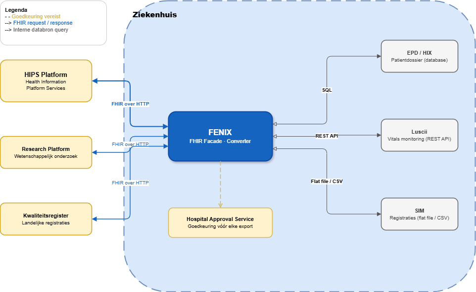
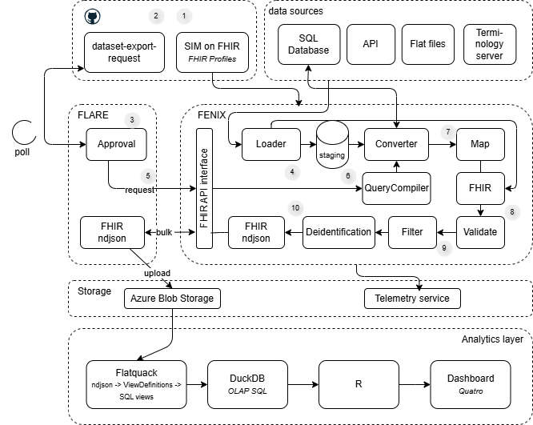

# Contents

- [What is FENIX?](#what-is-fenix)
  - [The driving use case — Cumuluz IBD within HEALTH-RI](#the-driving-use-case--cumuluz-ibd-within-health-ri)
  - [What does a FHIR request look like?](#what-does-a-fhir-request-look-like)
  - [FHIR Async Bulk Export — how it works](#fhir-async-bulk-export--how-it-works)
  - [What is a FHIR profile?](#what-is-a-fhir-profile)
  - [What is a ConceptMap?](#what-is-a-conceptmap)
  - [Why FENIX profiles against base FHIR R4 — the Dutch and European model landscape](#why-fenix-profiles-against-base-fhir-r4--the-dutch-and-european-model-landscape)
    - [The three layers of healthcare information modelling](#the-three-layers-of-healthcare-information-modelling)
    - [The European FHIR profile landscape](#the-european-fhir-profile-landscape)
    - [The Dutch FHIR profile landscape](#the-dutch-fhir-profile-landscape)
    - [Decision — profile against base FHIR R4 for now](#decision--profile-against-base-fhir-r4-for-now)
- [FENIX — annotations explained](#fenix--annotations-explained)
  - [❶ Dataset export request](#-dataset-export-request)
    - [The YAML — source of truth](#the-yaml--source-of-truth)
    - [Generated — Group.json](#generated--groupjson-cohort-as-fhir-group)
    - [Generated — Parameters.json](#generated--parametersjson-export-query-as-fhir-export-parameters)
    - [Profile validation](#profile-validation)
    - [All three files committed together](#all-three-files-committed-together)
    - [How the export runs — async bulk vs synchronous Bundle](#how-the-export-runs--async-bulk-vs-synchronous-bundle)
  - [❷ Approval](#-approval)
    - [Central approval — GitHub PR](#central-approval--github-pr)
    - [Local approval — Hospital Approval Service](#local-approval--hospital-approval-service)
  - [❸ Loading](#-loading)
    - [Layer 1 — Sources](#layer-1--sources)
    - [Layer 2 — Connectors](#layer-2--connectors)
    - [Layer 3 — Source interface](#layer-3--source-interface)
    - [Layer 4 — Staging database](#layer-4--staging-database)
    - [Layer 5 — Converter](#layer-5--converter)
  - [❹ How FENIX handles a live FHIR request](#-how-fenix-handles-a-live-fhir-request)
    - [How does a SearchParameter translate a request filter to a source field?](#how-does-a-searchparameter-translate-a-request-filter-to-a-source-field)
  - [❺ De-identification](#-de-identification)
    - [Pipeline position](#pipeline-position)
    - [Two-layer configuration](#two-layer-configuration)
    - [Execution order per resource](#execution-order-per-resource)
    - [Key management](#key-management)
    - [FLARE — the background service](#flare--the-background-service)
  - [❻ ConceptMap resolution](#-conceptmap-resolution)
    - [Step 1 — the ValueSet](#step-1--the-valueset-target-codes)
    - [Step 2 — the ConceptMap](#step-2--the-conceptmap-translation-rules)
    - [Step 3 — how FENIX resolves it at runtime](#step-3--how-fenix-resolves-it-at-runtime)

---

# What is FENIX?

**FENIX** stands for **FHIR ENabled Node for Information Exchange**.

It is a FHIR facade: an application deployed inside the hospital that presents itself as a FHIR server to the outside world. Internally, FENIX translates requests into queries against the hospital's source systems (EPD, flat files, APIs), converts the results into FHIR resources, and returns them via standard FHIR operations.

The primary goal of FENIX is to enable secure, controlled data sharing with **HIPS** (Health Information Platform Services), but the same facade can serve any FHIR-compatible consumer — research platforms, quality registries, or other hospital systems.

Key characteristics:

- The hospital retains full data sovereignty — no data is pushed without explicit approval.
- FENIX speaks FHIR outward but connects to non-FHIR source systems inward.
- A dataset export request (YAML + generated FHIR resources) is the unit of governance: it defines what data may be shared, with whom, and how often.

---

#### The driving use case — Cumuluz IBD within HEALTH-RI

The concrete goal that drives FENIX is to supply hospital data for the **Cumuluz IBD use case** — the first secondary use case being piloted within [HEALTH-RI](https://health-ri.nl).

**[HEALTH-RI](https://health-ri.nl)** is the Dutch national health research infrastructure — the full stack of facilities, governance, and tooling required to conduct health research at scale. This includes a **Health Data Access Body (HDAB)** for governed access to sensitive health data, and environments where research use cases can be deployed, integrated, and tested against real hospital data.

Within HEALTH-RI, **PLUGIN** is the component being piloted for federated learning — a model in which algorithms travel to the data rather than the data travelling to a central location. PLUGIN allows a use case to train or validate across multiple hospital datasets without any raw patient data leaving the institution.

**Cumuluz IBD** is the first secondary use case: using Inflammatory Bowel Disease patient data from hospitals for research and analysis. Secondary use means the data was originally collected for care delivery, and is now — with proper governance — made available for a research purpose. To be meaningful in a HEALTH-RI/PLUGIN context it needs structured, FHIR-formatted patient data from participating hospitals: IBD diagnoses, medication, lab results, care plans.

FENIX is the bridge that makes hospital data available in that format:

```
Hospital EPD / source systems
        │
        └── FENIX (FHIR facade)
              │  translates source data to FHIR on request
              │  enforces dataset export request governance
              ▼
        HIPS / HEALTH-RI
              │
              └── PLUGIN (federated learning pilot)
                    │
                    └── Cumuluz IBD use case
                          ← consumes FHIR-formatted IBD data
                          ← first secondary use case tested within HEALTH-RI
```

This use case is also the reason FENIX starts with base FHIR R4 profiles rather than waiting for a stable Dutch or European profile layer — see [Why FENIX profiles against base FHIR R4](#why-fenix-profiles-against-base-fhir-r4--the-dutch-and-european-model-landscape).

---



---

### What does a FHIR request look like?

A FHIR request is a plain HTTP GET to a well-known URL. The server returns JSON. No proprietary protocol, no special client — a browser or `curl` is enough.

**Example: search for female patients born after 1980**

```
GET /fhir/Patient?gender=female&birthdate=gt1980-01-01
Accept: application/fhir+json
```

The server responds with a **Bundle** — a JSON envelope that wraps one or more matching resources:

```json
{
  "resourceType": "Bundle",
  "type": "searchset",
  "total": 2,
  "entry": [
    {
      "resource": {
        "resourceType": "Patient",
        "id": "p-1042",
        "name": [
          {
            "family": "De Vries",
            "given": ["Anna"]
          }
        ],
        "gender": "female",
        "birthDate": "1985-03-22",
        "identifier": [
          {
            "system": "https://ziekenhuis.nl/patientnummer",
            "value": "10042"
          },
          {
            "system": "http://fhir.nl/fhir/NamingSystem/bsn",
            "value": "123456789"
          }
        ]
      }
    },
    {
      "resource": {
        "resourceType": "Patient",
        "id": "p-2187",
        "name": [
          {
            "family": "Janssen",
            "given": ["Sophie"]
          }
        ],
        "gender": "female",
        "birthDate": "1991-07-08",
        "identifier": [
          {
            "system": "https://ziekenhuis.nl/patientnummer",
            "value": "21087"
          },
          {
            "system": "http://fhir.nl/fhir/NamingSystem/bsn",
            "value": "987654321"
          }
        ]
      }
    }
  ]
}
```

Every field has a fixed meaning defined by the FHIR standard — `birthDate`, `gender`, `identifier`, and so on are the same across every FHIR server in the world. That is what makes FHIR useful for data exchange: both sides speak the same language without custom mapping.

FENIX receives this kind of request, translates the filters into queries against the hospital's source systems, and returns the result in exactly this format.

---

### FHIR Async Bulk Export — how it works

A regular FHIR search returns a **Bundle** synchronously: one HTTP call, one JSON response, everything in memory. This works for small result sets but breaks down for bulk exports — thousands of patients across multiple resource types won't fit in a single round-trip without timeouts or memory exhaustion.

The [FHIR Bulk Data Access IG](https://hl7.org/fhir/uv/bulkdata/) defines an asynchronous three-step pattern instead.

---

#### Step 1 — kick off

The client sends a `POST` to the `$export` operation on a Group resource. The `Prefer: respond-async` header tells the server not to wait:

```
POST /fhir/Group/oncology-active-2024/$export
Prefer: respond-async
Accept: application/fhir+json
```

The server responds immediately with `202 Accepted` and a `Content-Location` header pointing to a status endpoint. No data is returned yet — the server starts processing in the background.

```
HTTP/1.1 202 Accepted
Content-Location: /fhir/$export-status/run-f3a1c8
```

---

#### Step 2 — poll for completion

The client polls the status URL periodically.

While still running, the server returns `202` with a progress hint:

```
HTTP/1.1 202 Accepted
X-Progress: "processing 3 of 5 resource types"
```

When complete, the server returns `200` with a **manifest** — a JSON list of download URLs, one per resource type:

```json
{
  "transactionTime": "2024-03-15T02:00:00Z",
  "output": [
    { "type": "Patient",   "url": "/fhir/$export-files/run-f3a1c8/Patient.ndjson" },
    { "type": "Condition", "url": "/fhir/$export-files/run-f3a1c8/Condition.ndjson" }
  ]
}
```

---

#### Step 3 — download NDJSON

Each file is downloaded separately. The format is **NDJSON** (newline-delimited JSON): one complete FHIR resource per line, no wrapping array, no commas between lines:

```
{"resourceType":"Patient","id":"a3f2c1...","birthDate":"1975-03-01",...}
{"resourceType":"Patient","id":"9b1e4d...","birthDate":"1962-07-01",...}
```

This is streamable — the client reads line by line without loading the full file into memory.

---

| | Synchronous Bundle | Async bulk (`$export`) |
|---|---|---|
| Response | Single JSON response | NDJSON files, one per resource type |
| Size limit | Breaks above ~10k resources | No practical limit |
| Client model | Wait for response | Kick off → poll → download |
| Memory | All resources in memory at once | Streamed file by file |
| FHIR standard | Core FHIR | [Bulk Data Access IG](https://hl7.org/fhir/uv/bulkdata/) |

For how FENIX implements this pattern end-to-end — including FLARE's role in kicking off, polling, and forwarding to HIPS — see [How the export runs](#how-the-export-runs--async-bulk-vs-synchronous-bundle).

---

### What is a FHIR profile?

The base FHIR standard defines resources like [`Patient`](https://hl7.org/fhir/patient.html) with almost everything optional — it has to, because hospitals worldwide have different requirements. A **profile** is a `StructureDefinition` that constrains a base resource to fit a specific context: it can make fields required, prohibit fields that don't apply, or restrict which values are allowed.

Profiles stack. You start from the international base, derive a national profile, and then derive a hospital-specific profile from that.

```
hl7.org/fhir/Patient          ← international base (everything optional)
        │
        └── nl-core-Patient   ← Dutch national profile (BSN required, Dutch extensions)
                │
                └── ZiekenhuisPatient  ← hospital profile (further restrictions)
```

Each step only describes what *changes* from the parent — this is called the **differential**.

---

#### Example — base Patient StructureDefinition (international)

The base `StructureDefinition` for Patient defines the rules: cardinality (`min`/`max`) and, where applicable, which codes are allowed and how strictly. Below are a few representative fields — the full definition has ~30 elements.

```json
{
  "resourceType": "StructureDefinition",
  "url": "http://hl7.org/fhir/StructureDefinition/Patient",
  "name": "Patient",
  "differential": {
    "element": [
      {
        "id": "Patient.identifier",
        "path": "Patient.identifier",
        "min": 0,
        "max": "*"
      },
      {
        "id": "Patient.gender",
        "path": "Patient.gender",
        "min": 0,
        "max": "1",
        "binding": {
          "strength": "required",
          "valueSet": "http://hl7.org/fhir/ValueSet/administrative-gender"
        }
      },
      {
        "id": "Patient.birthDate",
        "path": "Patient.birthDate",
        "min": 0,
        "max": "1"
      },
      {
        "id": "Patient.maritalStatus",
        "path": "Patient.maritalStatus",
        "min": 0,
        "max": "1",
        "binding": {
          "strength": "extensible",
          "valueSet": "http://hl7.org/fhir/ValueSet/marital-status"
        }
      },
      {
        "id": "Patient.communication.language",
        "path": "Patient.communication.language",
        "min": 1,
        "max": "1",
        "binding": {
          "strength": "preferred",
          "valueSet": "http://hl7.org/fhir/ValueSet/languages"
        }
      }
    ]
  }
}
```

Key observations that explain the profiling choices below:
- `identifier` is `0..*` — the national profile can safely raise it to `1..*`.
- `gender` is already `required`-bound — a profile **cannot** override it with a different ValueSet.
- `maritalStatus` is `extensible` — a profile can tighten or prohibit it.
- `communication.language` is only `preferred` — a profile can tighten it to `required` with a custom ValueSet.

---

#### Deriving a national profile — making a field required

The Dutch **nl-core-Patient** profile extends the base and requires every patient to have a BSN (burgerservicenummer). The `differential` below is the only thing the profile needs to declare — everything else is inherited from the base.

```json
{
  "resourceType": "StructureDefinition",
  "url": "http://nictiz.nl/fhir/StructureDefinition/nl-core-Patient",
  "name": "NlCorePatient",
  "baseDefinition": "http://hl7.org/fhir/StructureDefinition/Patient",
  "differential": {
    "element": [
      {
        "id": "Patient.identifier",
        "path": "Patient.identifier",
        "min": 1
      },
      {
        "id": "Patient.identifier:bsn",
        "path": "Patient.identifier",
        "sliceName": "bsn",
        "min": 1,
        "max": "1",
        "comment": "BSN is mandatory under Dutch law (WGBO).",
        "type": [{ "code": "Identifier" }]
      }
    ]
  }
}
```

`min: 1` means the field is now **required**. A Patient resource that does not include a BSN identifier fails validation against this profile.

---

#### Deriving a hospital profile — prohibiting a field and changing a binding

The hospital extends **nl-core-Patient** further. Two changes:

1. `maritalStatus` is never collected here — **prohibit** it (`max: "0"`) so it cannot accidentally be sent.
2. `communication.language` is `preferred`-bound in the base (any language code is allowed). The hospital tightens this to `required` with a local ValueSet that only contains the languages actually supported in the system.

```json
{
  "resourceType": "StructureDefinition",
  "url": "https://ziekenhuis.nl/fhir/StructureDefinition/ZiekenhuisPatient",
  "name": "ZiekenhuisPatient",
  "baseDefinition": "http://nictiz.nl/fhir/StructureDefinition/nl-core-Patient",
  "differential": {
    "element": [
      {
        "id": "Patient.maritalStatus",
        "path": "Patient.maritalStatus",
        "max": "0",
        "comment": "Not collected; prohibited to prevent accidental disclosure."
      },
      {
        "id": "Patient.communication.language",
        "path": "Patient.communication.language",
        "binding": {
          "strength": "required",
          "valueSet": "https://ziekenhuis.nl/fhir/ValueSet/SupportedLanguages",
          "description": "Only nl-NL, en-GB and de-DE are registered in the EPD."
        }
      }
    ]
  }
}
```

| Change | How | Effect |
|---|---|---|
| Make field required | `min: 1` | Validation fails if the field is absent |
| Prohibit field | `max: "0"` | Validation fails if the field is present |
| Restrict binding | `binding.strength: "required"` + custom `valueSet` | Only codes from that ValueSet are accepted |

Binding strengths go from loose to strict: `example` → `preferred` → `extensible` → `required`. A profile can only tighten a binding, never loosen it.

---

### What is a ConceptMap?

A **ConceptMap** defines how codes from one system translate to codes in another. A profile says *which* codes are valid in the output (via its ValueSet binding); a ConceptMap says *how to get there* from whatever codes the hospital's source system uses internally.

```
EPD source data          ConceptMap               FHIR output
──────────────           ──────────────────────   ──────────────────────────────
"NL"           ───────►  "NL" → "nl-NL"  ───────► "nl-NL"  ✓ valid per profile
"EN"           ───────►  "EN" → "en-GB"  ───────► "en-GB"  ✓ valid per profile
"DU"           ───────►  no mapping       ───────► error: unmapped source code
```

The profile and ConceptMap are linked by the **ValueSet URI**: the profile binding points to a ValueSet, and the ConceptMap declares the same URI as its `targetScope`. This is how FENIX resolves which ConceptMap to apply to which field.

Each mapping carries a `relationship` that describes how exact the translation is:

| Value | Meaning |
|---|---|
| `equivalent` | The codes mean the same thing |
| `source-is-narrower-than-target` | Source is more specific; target is broader |
| `source-is-broader-than-target` | Source is broader; some detail is lost in translation |
| `not-related-to` | No meaningful relationship — use only to document a deliberate non-mapping |

For how FENIX resolves ConceptMaps at runtime — with full ValueSet, ConceptMap, and conversion examples — see [❻ ConceptMap resolution](#-conceptmap-resolution).

---

### Why FENIX profiles against base FHIR R4 — the Dutch and European model landscape

#### The three layers of healthcare information modelling

Healthcare information modelling runs through three distinct layers. The top layers define *what* must be captured; the bottom layer defines *how*.

```
┌─────────────────────────────────────────────────────────────────┐
│  Layer 1 — Conceptual models           technology-agnostic      │
│  ZIBs (NL)  ·  EHDS regulation text (EU)                       │
│  No FHIR, no database, no wire format — pure information model  │
└──────────────────────────┬──────────────────────────────────────┘
                           │ expressed as
┌──────────────────────────▼──────────────────────────────────────┐
│  Layer 2 — FHIR Logical Models         still technology-agnostic│
│  StructureDefinition (kind: logical)                            │
│  EHDS EHRxF logical models (EU)                                 │
│  Machine-readable but not yet an implementation profile         │
└──────────────────────────┬──────────────────────────────────────┘
                           │ implemented as
┌──────────────────────────▼──────────────────────────────────────┐
│  Layer 3 — FHIR Profiles               implementation           │
│  StructureDefinition (kind: resource)                           │
│  EU Core · NL Core · hospital profiles                          │
│  Constrain base FHIR resources — deployable software artefacts  │
└─────────────────────────────────────────────────────────────────┘
```

**Layer 1 — Conceptual models**

[ZIBs (Zorginformatiebouwstenen)](https://zibs.nl/wiki/ZIB_Publicatie_2020(NL)) are the Dutch national standard for clinical information models. A ZIB defines *what* information should be captured — its structure, data types, and clinical meaning — without specifying *how* it is stored or exchanged. No FHIR, no database schema, no wire format.

The [EHDS (European Health Data Space)](https://health.ec.europa.eu/ehealth-digital-health-and-care/european-health-data-space_en) regulation operates at the same level of abstraction. The EHDS imposes requirements on member states for health data exchange but does not itself mandate a specific technical format — it works at the policy and concept level.

**Layer 2 — FHIR Logical Models**

A FHIR Logical Model is *expressed* in FHIR syntax (`StructureDefinition` with `kind: logical`) but is not yet an implementation profile. It makes a conceptual model machine-readable without binding it to a specific resource type or implementation. This is the bridge layer.

The [EHDS EHRxF (Electronic Health Record Exchange Format)](https://www.xt-ehr.eu/fhir/models/en/) mandate translates EHDS policy requirements into FHIR Logical Models. Like ZIBs, these models define *what* must be captured — they are technology-agnostic in the sense that they do not mandate how a system stores or serves the data.

**Layer 3 — FHIR Profiles**

This is where conceptual and logical models become deployable software artefacts. A FHIR profile (`StructureDefinition` with `kind: resource`) constrains a base FHIR resource — making fields required, prohibiting unused fields, restricting value sets — as shown in the profile examples above.

---

#### The European FHIR profile landscape

Not all European FHIR profiles originate from EHDS. Several streams exist in parallel, each with different governance and timelines:

| Stream | Published by | Relation to EHDS |
|---|---|---|
| [HL7 Europe base profiles](https://build.fhir.org/ig/hl7-eu/base/) | HL7 Europe | Influenced by EHDS; serves as the EU Core foundation |
| [EHRxF profiles](https://www.xt-ehr.eu/fhir/models/en/) | HL7 Europe / EC | Directly mandated by EHDS; derived from EHRxF logical models |
| [IPS (International Patient Summary)](https://build.fhir.org/ig/HL7/fhir-ips/) | HL7 International | Predates EHDS; now being aligned with EHRxF requirements |
| [HL7 Europe laboratory IG](https://build.fhir.org/ig/hl7-eu/laboratory/) | HL7 Europe | Domain-specific; developed partly in EHDS context |
| MyHealth@EU profiles | EU / eHN | Specifically for cross-border exchange; aligned with EHDS |

Together these converge into what can be called the **EU Core** — the European FHIR profile layer that sits directly above base FHIR R4.

---

#### The Dutch FHIR profile landscape

Nictiz has built the Dutch [nl-core profiles](https://simplifier.net/nictiz-r4-zib2020) based on ZIBs. These are in production use across Dutch healthcare today.

The EHDS mandate changes the foundation for future Dutch profiles. Nictiz will need to publish a **new NL Core derived from EU Core, not from ZIBs**. This is not an update to the current NL Core — it will be a new profile layer, because its parent changes from base FHIR R4 to EU Core.

ZIBs remain relevant as a clinical concept layer, but the FHIR profile chain will change:

```
Current chain:

hl7.org/fhir/R4 (base)
        │
        └── nl-core (Nictiz)     ← based on ZIBs
                │
                └── Hospital profiles


Future chain (expected):

hl7.org/fhir/R4 (base)
        │
        └── EU Core (HL7 Europe) ← based on EHDS EHRxF logical models
                │
                └── new NL Core (Nictiz)  ← based on EU Core, not ZIBs
                        │
                        └── Hospital profiles
```

In addition, VWS, Nictiz, and Cumuluz are developing the **Gezondheids Informatie Model (GIM)** — a new Dutch health information model intended to align Dutch clinical concepts with the European framework. How GIM relates to ZIBs, EU Core, and a future NL Core is not yet defined.

---

#### Decision — profile against base FHIR R4 for now

**Context:** Three overlapping developments make the Dutch FHIR profile landscape unstable:

1. **EU Core is still maturing.** The HL7 Europe profiles are under active development as the EHDS EHRxF mandate is being formalised.
2. **NL Core will be rebuilt, not updated.** A new NL Core derived from EU Core does not yet exist. Building on the current ZIB-based NL Core means inheriting a layer that will be replaced.
3. **GIM is in development.** The relationship between GIM, ZIBs, EU Core, and a future NL Core is undefined.

**Decision:** FENIX profiles its resources directly against **base FHIR R4**, not against NL Core or any intermediate national layer.

This is a **temporary, pragmatic choice**. The goal is to learn and build now, without coupling to a profile layer that is about to be replaced. When a stable NL Core aligned with EU Core is published — and when GIM's relationship to that layer is clear — we will migrate.

**What this means in practice:**

- Profiles in dataset export requests (`implementation-guide` / `profile` fields) reference base FHIR R4 or Santeon-specific profiles built directly on R4.
- We track the [EHDS EHRxF IG](https://www.xt-ehr.eu/fhir/models/en/) and [HL7 Europe base IG](https://build.fhir.org/ig/hl7-eu/base/) to stay informed about what the future NL Core will look like.
- When Nictiz publishes an EU-Core-aligned NL Core, we insert a national profile layer between base R4 and our hospital profiles — changing `baseDefinition` chains, not the data model itself.

---

# FENIX — annotations explained




---

## ❶ Dataset export request

The **dataset export request** is the single approved artifact that drives FENIX.
The YAML is the **human-authored source of truth**. From it, FENIX generates the
corresponding FHIR resources automatically — they are never written by hand.

```
oncology-active-2024.yaml          ← human authors this
        │
        └── fenix generate
              ├── Group.json        ← generated: cohort as FHIR Group (Bulk Cohort profile)
              ├── Parameters.json   ← generated: export query as FHIR $export parameters
              └── (stored in Git alongside the YAML, committed in the same PR)
```

---

### The YAML — source of truth

```yaml
# dataset-export-request: oncology-active-2024.yaml

implementation-guide: "https://ig.santeon.nl/sim-on-fhir|0.1.0"  # profiles applied to both cohort filters and exported resources

cohort:
  id: oncology-active-2024
  name: Active oncology patients 2024
  filter:
    - resource: Condition
      params: "code=363346000&clinical-status=active"
    - resource: Encounter
      params: "date=ge2023-01-01&class=IMP"

export-query:
  - resource: Patient
    params: ""
  - resource: Observation
    params: "code=363346000&status=final&date=ge2023-01-01"
  - resource: Condition
    params: "code=363346000&clinical-status=active"
  - resource: MedicationStatement
    params: "status=active"
  - resource: CarePlan
    params: "status=active"

frequency:
  mode: on-demand          # on-demand | scheduled
  cron: ~                  # only set when mode is scheduled, e.g. "0 2 * * *"
  cohort-refresh: dynamic  # dynamic = re-evaluate who is in scope each run
                           # snapshot = patient list frozen at first run

de-identification:
  base: "https://ig.santeon.nl/sim-on-fhir/de-identification"  # standard ruleset from the IG
  # no overrides — standard rules apply as-is
```

For use cases that require stricter age generalisation, the `de-identification` block can override individual rules. The geboortezorg (maternity care) use case, for example, clamps age to 0–45 instead of the standard 18–85:

```yaml
de-identification:
  base: "https://ig.santeon.nl/sim-on-fhir/de-identification"
  rules:
    - path: "Patient.birthDate"   # replaces the standard clamp-age for this export
      action: clamp-age
      min-age: 0
      max-age: 45
```

---

### Generated — Group.json (cohort as FHIR Group)

The `cohort` block becomes a FHIR **Group** resource using the Bulk Cohort profile.
The `filter` entries map to `member-filter` extensions, one per resource type.
FENIX evaluates these at runtime to resolve the patient list.

```json
{
  "resourceType": "Group",
  "id": "oncology-active-2024",
  "meta": {
    "profile": [
      "http://hl7.org/fhir/uv/bulkdata/StructureDefinition/bulk-cohort"
    ]
  },
  "type": "person",
  "actual": false,
  "name": "Active oncology patients 2024",
  "extension": [
    {
      "url": "http://hl7.org/fhir/uv/bulkdata/StructureDefinition/member-filter",
      "valueString": "Condition?code=363346000&clinical-status=active"
    },
    {
      "url": "http://hl7.org/fhir/uv/bulkdata/StructureDefinition/member-filter",
      "valueString": "Encounter?date=ge2023-01-01&class=IMP"
    },
    {
      "url": "http://hl7.org/fhir/uv/bulkdata/StructureDefinition/members-refreshed",
      "valueDateTime": "2024-01-15T02:00:00Z"
    }
  ]
}
```

> `members-refreshed` is populated by FENIX at runtime, not generated from the YAML.
> It records when the cohort was last evaluated — useful for auditing and debugging.

---

### Generated — Parameters.json (export query as FHIR $export parameters)

The `export-query` block becomes a FHIR **Parameters** resource that maps directly
to the `Group/[id]/$export` operation parameters defined in the Bulk Data Access IG.

```json
{
  "resourceType": "Parameters",
  "id": "oncology-active-2024-export",
  "parameter": [
    {
      "name": "group-id",
      "valueString": "oncology-active-2024"
    },
    {
      "name": "_type",
      "valueString": "Patient,Observation,Condition,MedicationStatement"
    },
    {
      "name": "_typeFilter",
      "valueString": "Observation?code=363346000&status=final&date=ge2023-01-01"
    },
    {
      "name": "_typeFilter",
      "valueString": "Condition?code=363346000&clinical-status=active"
    },
    {
      "name": "_typeFilter",
      "valueString": "MedicationStatement?status=active"
    },
    {
      "name": "_outputFormat",
      "valueString": "application/fhir+ndjson"
    }
  ]
}
```

> `_typeFilter` is the standard Bulk Data IG parameter that scopes which resources
> within a type are included — it is the FHIR representation of the `export-query` entries.
> `Patient` has no filter so it appears only in `_type`, not in `_typeFilter`.

---

### Profile validation

Before a converted resource is written to the export output, FENIX validates it against a FHIR profile. Two ways to specify which profile to use:

---

#### Option A — Implementation Guide (top-level, covers cohort and export)

Set `implementation-guide` at the top level of the request YAML. FENIX fetches the IG's package and finds the matching `StructureDefinition` for each resource type — applied to both the `cohort` filters and the `export-query` resources.

```yaml
implementation-guide: "https://ig.santeon.nl/careplan"

cohort:
  ...

export-query:
  ...
```

Use this when all (or most) resources in the request are profiled by the same IG. It avoids repeating a profile URL on every entry and ensures cohort filters and exported resources are validated consistently.

The IG used for Santeon exports is the **Santeon CarePlan Implementation Guide**:

| Field | Value |
|---|---|
| Canonical URL | `https://ig.santeon.nl/careplan` |
| Publisher | Santeon |
| Version | 0.1.0 |
| FHIR version | R4 (4.0.1) |

---

#### Option B — per-resource profile (targeted override)

Set `profile` on an individual `export-query` entry. Use this when a resource needs a profile from outside the IG, or when no IG applies.

```yaml
export-query:
  - resource: CarePlan
    params: "status=active"
    profile: "https://ig.santeon.nl/careplan/StructureDefinition/santeon-careplan"
```

The **SanteonCarePlan** profile (`https://ig.santeon.nl/careplan/StructureDefinition/santeon-careplan`) mandates `status`, `intent`, `category`, `subject`, `period.start`, and `period.end`, and prohibits base elements not present in Santeon's data dictionary.

---

#### Combining both

A per-resource `profile` always overrides the IG for that specific resource. All other resources fall back to the top-level IG.

```yaml
implementation-guide: "https://ig.santeon.nl/careplan"

export-query:
  - resource: Patient
    params: ""
  - resource: CarePlan
    params: "status=active"
    profile: "https://other.ig/StructureDefinition/other-careplan"  # overrides IG for this entry only
```

When neither an IG nor a per-resource `profile` is set, FENIX validates against the base FHIR R4 resource definition only.

---

### All three files committed together

```
requests/
└── oncology-active-2024/
    ├── oncology-active-2024.yaml       ← human authors this
    ├── Group.json                       ← generated by fenix generate
    └── Parameters.json                  ← generated by fenix generate
```

The generated files are committed into Git in the same PR as the YAML.
This means reviewers can read either the YAML (human-friendly) or the FHIR JSON
(machine-exact), and the CI pipeline can validate both.
The FHIR JSON is what FENIX actually loads at runtime.

---

### How the export runs — async bulk vs synchronous Bundle

A regular FHIR request returns a **Bundle** synchronously: one HTTP call, one JSON response, everything in memory. This works for small result sets but breaks down for bulk exports of thousands of patients across multiple resource types.

FENIX uses the [FHIR Bulk Data Access IG](https://hl7.org/fhir/uv/bulkdata/) instead. This is an **asynchronous** protocol: kick off the export, poll until it is ready, then download the output as NDJSON files — one file per resource type.

| | Synchronous Bundle | Async bulk (`$export`) |
|---|---|---|
| Response | Single JSON response | NDJSON files, one per resource type |
| Size limit | Breaks above ~10k resources | No practical limit |
| Client model | Wait for response | Kick off → poll → download |
| Memory | All resources in memory at once | Streamed file by file |
| FHIR standard | Core FHIR | [Bulk Data Access IG](https://hl7.org/fhir/uv/bulkdata/) |

---

#### Step 1 — kick off the export

FLARE sends a `POST` to the `$export` operation on the Group resource. The `Prefer` header signals that the client expects an async response:

```
POST /fhir/Group/oncology-active-2024/$export
Prefer: respond-async
Accept: application/fhir+json
```

FENIX responds immediately with `202 Accepted` and a `Content-Location` header pointing to a status endpoint. No data is returned yet — FENIX starts processing in the background.

```
HTTP/1.1 202 Accepted
Content-Location: /fhir/$export-status/run-f3a1c8
```

---

#### Step 2 — poll for completion

FLARE polls the status URL periodically:

```
GET /fhir/$export-status/run-f3a1c8
```

While the export is still running, FENIX returns `202` with a progress indicator:

```
HTTP/1.1 202 Accepted
X-Progress: "processing 3 of 5 resource types"
```

When complete, FENIX returns `200` with a manifest listing the output files:

```json
{
  "transactionTime": "2024-03-15T02:00:00Z",
  "requiresAccessToken": false,
  "output": [
    { "type": "Patient",             "url": "/fhir/$export-files/run-f3a1c8/Patient.ndjson" },
    { "type": "Observation",         "url": "/fhir/$export-files/run-f3a1c8/Observation.ndjson" },
    { "type": "Condition",           "url": "/fhir/$export-files/run-f3a1c8/Condition.ndjson" },
    { "type": "MedicationStatement", "url": "/fhir/$export-files/run-f3a1c8/MedicationStatement.ndjson" }
  ]
}
```

---

#### Step 3 — download the NDJSON files

Each file in `output` is downloaded separately. Each line is one complete FHIR resource — no wrapping array, no commas between lines:

```
# Patient.ndjson
{"resourceType":"Patient","id":"a3f2c1...","birthDate":"1975-03-01",...}
{"resourceType":"Patient","id":"9b1e4d...","birthDate":"1962-07-01",...}
```

The files are already de-identified at this point. FENIX applied the de-identification rules on the Go structs before writing the NDJSON — FLARE receives output that is safe to forward to HIPS without further transformation. See [❹ De-identification](#-de-identification).

---

## ❷ Approval

Approval happens at two levels: **central** (GitHub, once per version) and
**local** (Hospital Approval Service, before every run).

### Central approval — GitHub PR

Governs the *definition* of the request. Required whenever the YAML is
created or changed.

```
fenix generate                         generates Group.json + Parameters.json from YAML
        │
        ▼
PR opened (YAML + Group.json + Parameters.json)
        │
        ▼
CODEOWNERS review
  data steward + privacy officer approve
  checks: cohort scope, exported fields, frequency justification
        │
        ▼
CI checks (automated)
  YAML schema valid · FHIR params known to FENIX
  column allowlist · no free-text · no direct identifiers
        │
        ▼
merge → available in FENIX runtime · audit trail locked
```

### Local approval — Hospital Approval Service

Governs *execution*. Required before every single run, regardless of frequency mode.

| Mode | How local approval works |
|---|---|
| `on-demand` | Staff member initiates the run in the local UI — this act is the approval. |
| `scheduled` | Cron proposes a run. Staff member (or configured auto-approve rule) confirms before FENIX executes. |

> **Central approval** defines what is *allowed*.
> **Local approval** decides what *actually runs*.
> The hospital retains full control over when data leaves the EPD.

---

## ❸ Loading

Loading is the step that pulls raw data from source systems into the
**staging database**, where it becomes queryable SQL. Only after loading
does the converter run its SQL-to-FHIR queries.


---

### Layer 1 — Sources

The origin systems: **Luscii**, **SIM**, **HIX**. These are external to FENIX
and are never written to — they are read-only data suppliers.

---

### Layer 2 — Connectors

How data leaves a source system:

| Connector | Description |
|---|---|
| `API` | REST call to an external service (e.g. Luscii Vitals API) |
| `Flat file` | CSV files on disk (e.g. SIM export) |
| `Database` | Direct SQL connection to a source database |

---

### Layer 3 — Source (interface)

Each connector maps to a `Source` implementation (`internal/source`).
The `type:` field in config selects which implementation to use — this is a
per-source choice, independent of environment.

| Implementation | Config `type` | What it does |
|---|---|---|
| `LusciiSource` | `api` | Calls the live REST API; typed deserialisation per source |
| `LocalSource` | `local` | Reads all files from `dir`; `.json` and `.csv` auto-detected by extension |

**`LocalSource` is generic.** It handles both JSON (API-shaped) and CSV files from
the same directory. Switching from live to local — or adding a new source like SIM —
requires no new code, only a `dir` entry in config.

```yaml
sources:
  luscii:
    type: local                   # api | local — per source, not per environment
    dir: "test/data/luscii"       # .json files → JSON parser; .csv files → CSV parser

  hix_patients:                   # flat file source — same type, different format
    type: local
    dir: "data/hix"
    delimiter: ";"

  luscii_live:                    # switch one source to live API without touching others
    type: api
    base_url: "https://vitalsapi.luscii.com"
    api_key: ""
```

Adding a new API source requires one Go file implementing the `Source` interface
and one `case` in `buildSource()`.

---

### Layer 4 — Staging database

All loaders write into a shared **staging database** (SQLite by default).
The staging database is a transient, per-run store — it exists only to make
raw source data queryable by the converter's SQL files.

| Config | Behaviour |
|---|---|
| `path: ""` *(default)* | In-memory SQLite — fast, no file written, lost after the run |
| `path: output/staging.db` | Persisted SQLite — survives the run, useful for debugging SQL queries |
| `type: postgres` | PostgreSQL — for shared or production staging environments |

```yaml
database:
  type: sqlite
  # path: ""                    # default: in-memory
  # path: output/staging.db     # persist for debugging
```

---

### Layer 5 — Converter

After loading, the converter reads `.sql` files from `queries/<sourceName>/`
and executes each against the staging database. Each SELECT produces rows
that are assembled into FHIR resources (see the SQL format in the help output).

The **no-transformation path** (FHIR JSON connector) bypasses the staging
database entirely — data that is already valid FHIR JSON is passed through
directly.

---

## ❹ How FENIX handles a live FHIR request

This section covers the real-time request path — what happens when a FHIR consumer sends a search request to FENIX, as opposed to triggering a batch export.

### How does a SearchParameter translate a request filter to a source field?

A FHIR request carries filters as URL parameters:

```
GET /fhir/Patient?language=nl-NL
```

The parameter name `language` is just a string. The server needs to know *which field* on the Patient resource it refers to, and how to evaluate it. That definition lives in a **SearchParameter** resource.

---

#### The SearchParameter resource

A SearchParameter ties a URL parameter name to a FHIRPath expression that points to the field(s) on the resource it searches.

```json
{
  "resourceType": "SearchParameter",
  "url": "https://ziekenhuis.nl/fhir/SearchParameter/Patient-language",
  "code": "language",
  "base": ["Patient"],
  "type": "token",
  "expression": "Patient.communication.language"
}
```

| Field | Role |
|---|---|
| `code` | The URL parameter name (`?language=...`) |
| `base` | Which resource type(s) this applies to |
| `type` | How the value is interpreted: `token` (code), `string`, `date`, `reference`, … |
| `expression` | FHIRPath pointing to the field on the resource |

When the request `?language=nl-NL` arrives, FENIX resolves `language` → SearchParameter → `Patient.communication.language` → token filter on that field.

---

#### How FENIX evaluates a filter — post-conversion on Go structs

FENIX does not push filters down to the source system. Instead it always converts the full source data to FHIR Go structs first, then evaluates the filter directly on those structs using the FHIRPath expression from the SearchParameter. Only matching structs are included in the response Bundle.

```
① Request arrives
   GET /fhir/Patient?language=nl-NL

② SearchParameter resolves the parameter name to a FHIRPath expression
   "language"  →  Patient.communication.language  (type: token)

③ All source rows are loaded and converted to FHIR Patient structs in Go
   ConceptMap (forward): NL → nl-NL,  EN → en-GB,  DE → de-DE

④ The FHIRPath expression is evaluated on each Go struct
   patient.Communication[0].Language.Coding[0].Code == "nl-NL"  →  keep
   patient.Communication[0].Language.Coding[0].Code == "en-GB"  →  drop

⑤ Matching structs are wrapped in a Bundle and returned
```

Because the filter runs after conversion, it operates on FHIR codes already — no reverse ConceptMap lookup is needed. The same struct that was produced by the ConceptMap in step ③ is the one being tested in step ④.

---

#### Filtering by a single code

```
GET /fhir/Patient?language=nl-NL
```

SearchParameter expression `Patient.communication.language` is evaluated on every converted Patient struct. Structs where that field equals the token `nl-NL` are kept; all others are dropped before the Bundle is assembled.

---

#### Filtering by a ValueSet — the `:in` modifier

Instead of a single code you can filter on *all codes in a ValueSet* using the `:in` modifier:

```
GET /fhir/Patient?language:in=https://ziekenhuis.nl/fhir/ValueSet/SupportedLanguages
```

This means: *keep resources whose `communication.language` is any code contained in that ValueSet.*

```
① ValueSet is expanded
   https://.../SupportedLanguages  →  { nl-NL, en-GB, de-DE }

② All source rows are converted to FHIR Patient structs (ConceptMap applied)

③ FHIRPath expression evaluated on each struct
   patient.Communication[x].Language  in  { nl-NL, en-GB, de-DE }  →  keep / drop
```

The ValueSet URI in the request is the same URI that appears as `targetScope` in the ConceptMap — the codes the ConceptMap produces are exactly the codes the ValueSet contains, so the membership check in step ③ always works cleanly.

---

#### Source-level pushdown — not yet implemented

Evaluating filters on Go structs means all source rows are always loaded and converted, even those that will be dropped. For large datasets, pushing the filter down to the source query (SQL `WHERE` clause or API query parameter) before conversion would be more efficient.

This is a planned optimisation. When implemented, it will be configurable per source — sources that support it can use pushdown; others fall back to the post-conversion path described above. Pushdown requires a reverse ConceptMap lookup (FHIR filter code → source code) that is not needed on the current path.

---

## ❺ De-identification

FENIX exports patient data for secondary use — research purposes for which the data was not originally collected. Before that data leaves the hospital, identifiers must be removed or transformed so that the data cannot be traced back to an individual without additional information held by the hospital. This is **pseudonymisation** under GDPR: the data is de-identified, but the hospital retains a key that allows re-identification if legally required.

---

### Pipeline position

De-identification runs on the Go structs, after filtering and before serialisation to NDJSON. Working on typed structs means the full resource shape is available — no string parsing over raw JSON.

```
source data
    → staging DB → SQL queries
    → Go structs
    → filter (FHIRPath / search params)
    → ❹ de-identify              ← here
    → serialize to NDJSON
    → write output files
    → serve download links
```

FLARE, which downloads and forwards to HIPS, receives already-de-identified NDJSON.

---

### Two-layer configuration

Rules are configured at two levels that compose at runtime.

**Layer 1 — IG standard set (`de-identification.json`)**

Each Implementation Guide package ships a `de-identification.json` — a plain JSON file versioned alongside the IG, not a `StructureDefinition`. It defines the default ruleset for all exports using that IG:

```json
{
  "id": "de-identification-default",
  "version": "0.1.0",
  "rules": [
    {
      "path": "Patient.id",
      "action": "hash",
      "algorithm": "hmac-sha256",
      "propagate-to": ["*.subject", "*.patient"]
    },
    {
      "path": "Patient.identifier",
      "action": "hash",
      "algorithm": "hmac-sha256"
    },
    {
      "path": "**.ofType(date)",
      "action": "shift",
      "max-days": 15
    },
    {
      "path": "Patient.birthDate",
      "action": "first-of-month"
    },
    {
      "path": "Patient.birthDate",
      "action": "clamp-age",
      "min-age": 18,
      "max-age": 85
    }
  ]
}
```

`propagate-to` on `Patient.id` limits reference updates to `*.subject` and `*.patient` only — not every `Reference` field in every resource.

**Layer 2 — per-export override (YAML)**

The `de-identification` block in the dataset export request YAML can override individual rules. See [The YAML — source of truth](#the-yaml--source-of-truth) for full examples.

Override semantics:

| Scenario | Behaviour |
|---|---|
| Same `path` as a standard rule | Per-export rule **replaces** the standard rule for that path |
| `action: none` | Standard rule for that path is **disabled** |
| New `path` not in the standard set | Rule is **added** on top of the standard set |

---

### Execution order per resource

Rules are applied from most specific path to most general — `Patient.birthDate` takes precedence over `**.ofType(date)`:

```
① hash Patient.id
     → rewrite *.subject and *.patient references across all resources in the export

② hash Patient.identifier (all slices)

③ Patient.birthDate (specific rules win, applied in order):
     first-of-month  →  clamp-age (min/max)

④ all other date fields (general rule):
     shift ± N days, consistent per patient
```

The per-patient shift is derived deterministically so that temporal relationships between resources are preserved within one run:

```
shift_days = HMAC(env_key + run_id, patient_id) mod 31 − 15
```

`run_id` is a UUID generated once per export run — consistent per patient within that run, different across runs.

---

### Key management

The HMAC key never appears in the YAML, in generated FHIR artefacts, or in Git:

```
FENIX_DEIDENT_KEY=<base64-encoded secret>   # .env — stays inside the hospital
```

The hospital retains this key. A privacy officer with access to the key and the source data can reverse the pseudonymisation for any individual patient if legally required.

---

### FLARE — the background service

**FLARE** (FENIX Local Approval, Run, and Export) runs locally alongside FENIX and handles the full export lifecycle — from polling for approved requests to forwarding de-identified data to HIPS.

```
FLARE (local, next to FENIX)
        │
        ├── ① polls GitHub repo for new / updated export requests
        │         reads YAML + FHIR artefacts after central approval (PR merge)
        │
        ├── ② presents local approval step to hospital staff
        │         (Hospital Approval Service — see ❷ Approval)
        │
        ├── ③ fires approved export at FENIX
        │         POST /fhir/Group/[id]/$export
        │
        ├── ④ polls FENIX until export is complete
        │         GET [Content-Location header from 202 response]
        │
        └── ⑤ downloads de-identified NDJSON → forwards to HIPS
```

FENIX does not push data anywhere. It produces output and serves links. FLARE is the only component that retrieves those files and moves data onward — keeping FENIX stateless with respect to the destination.

---

## ❻ ConceptMap resolution

When FENIX converts a source row to a FHIR resource, it needs to translate the hospital's internal codes to the standard codes required by the profile. The ConceptMap is the artefact that defines those translation rules. See [What is a ConceptMap?](#what-is-a-conceptmap) for a conceptual overview.

---

### Step 1 — the ValueSet (target codes)

The profile binding points to a ValueSet that lists all valid output codes. FENIX uses the ValueSet URI as the key to find the right ConceptMap.

```json
{
  "resourceType": "ValueSet",
  "url": "https://ziekenhuis.nl/fhir/ValueSet/SupportedLanguages",
  "name": "SupportedLanguages",
  "compose": {
    "include": [
      {
        "system": "urn:ietf:bcp:47",
        "concept": [
          { "code": "nl-NL", "display": "Dutch (Netherlands)" },
          { "code": "en-GB", "display": "English (United Kingdom)" },
          { "code": "de-DE", "display": "German (Germany)" }
        ]
      }
    ]
  }
}
```

---

### Step 2 — the ConceptMap (translation rules)

The ConceptMap maps from the EPD's internal codes to the standard codes the ValueSet expects. Its `targetScope` matches the ValueSet URI in the profile binding — that is how FENIX links the two.

```json
{
  "resourceType": "ConceptMap",
  "url": "https://ziekenhuis.nl/fhir/ConceptMap/EpdTaalNaarBcp47",
  "name": "EpdTaalNaarBcp47",
  "sourceScope": "https://ziekenhuis.nl/fhir/ValueSet/EpdTaalcodes",
  "targetScope": "https://ziekenhuis.nl/fhir/ValueSet/SupportedLanguages",
  "group": [
    {
      "source": "https://ziekenhuis.nl/fhir/CodeSystem/EpdTaalcodes",
      "target": "urn:ietf:bcp:47",
      "element": [
        {
          "code": "NL",
          "display": "Nederlands",
          "target": [{ "code": "nl-NL", "display": "Dutch (Netherlands)", "relationship": "equivalent" }]
        },
        {
          "code": "EN",
          "display": "Engels",
          "target": [{ "code": "en-GB", "display": "English (United Kingdom)", "relationship": "equivalent" }]
        },
        {
          "code": "DE",
          "display": "Duits",
          "target": [{ "code": "de-DE", "display": "German (Germany)", "relationship": "equivalent" }]
        }
      ]
    }
  ]
}
```

---

### Step 3 — how FENIX resolves it at runtime

When FENIX converts a source row to a FHIR resource:

1. It reads the raw value from the EPD: `"NL"`
2. It checks the profile for `Patient.communication.language` — the binding points to `https://ziekenhuis.nl/fhir/ValueSet/SupportedLanguages`
3. It finds the ConceptMap whose `targetScope` matches that URI
4. It looks up `"NL"` in the ConceptMap and gets `"nl-NL"`
5. It writes `"nl-NL"` into the FHIR output — the resource now validates against the profile

```
① EPD value:  "NL"
② Profile binding → https://.../SupportedLanguages
③ ConceptMap targetScope matches → EpdTaalNaarBcp47
④ Lookup "NL" → "nl-NL"
⑤ FHIR output: "nl-NL"  ✓ valid
```

If no mapping exists for a source code, FENIX raises a conversion error rather than silently producing an invalid resource.