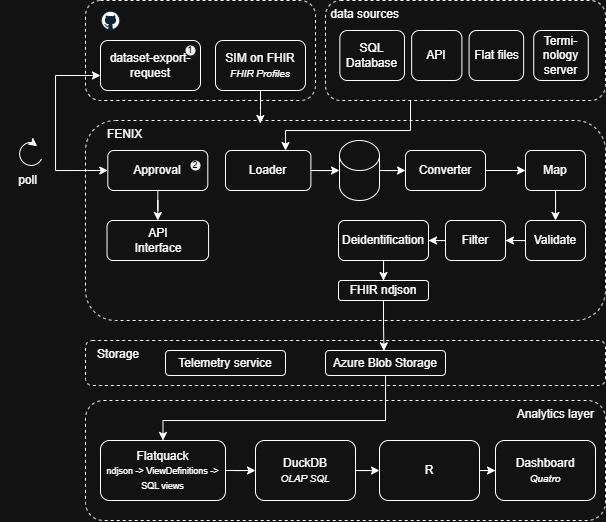

# FENIX — annotations explained




---

## ❶ Dataset export request

The **dataset export request** is the single approved artifact that drives FENIX.
The YAML is the **human-authored source of truth**. From it, FENIX generates the
corresponding FHIR resources automatically — they are never written by hand.

```
oncology-active-2024.yaml          ← human authors this
        │
        └── fenix generate
              ├── Group.json        ← generated: cohort as FHIR Group (Bulk Cohort profile)
              ├── Parameters.json   ← generated: export query as FHIR $export parameters
              └── (stored in Git alongside the YAML, committed in the same PR)
```

---

### The YAML — source of truth

```yaml
# dataset-export-request: oncology-active-2024.yaml

cohort:
  id: oncology-active-2024
  name: Active oncology patients 2024
  filter:
    - resource: Condition
      params: "code=363346000&clinical-status=active"
    - resource: Encounter
      params: "date=ge2023-01-01&class=IMP"

export-query:
  - resource: Patient
    params: ""
  - resource: Observation
    params: "code=363346000&status=final&date=ge2023-01-01"
  - resource: Condition
    params: "code=363346000&clinical-status=active"
  - resource: MedicationStatement
    params: "status=active"

frequency:
  mode: on-demand          # on-demand | scheduled
  cron: ~                  # only set when mode is scheduled, e.g. "0 2 * * *"
  cohort-refresh: dynamic  # dynamic = re-evaluate who is in scope each run
                           # snapshot = patient list frozen at first run
```

---

### Generated — Group.json (cohort as FHIR Group)

The `cohort` block becomes a FHIR **Group** resource using the Bulk Cohort profile.
The `filter` entries map to `member-filter` extensions, one per resource type.
FENIX evaluates these at runtime to resolve the patient list.

```json
{
  "resourceType": "Group",
  "id": "oncology-active-2024",
  "meta": {
    "profile": [
      "http://hl7.org/fhir/uv/bulkdata/StructureDefinition/bulk-cohort"
    ]
  },
  "type": "person",
  "actual": false,
  "name": "Active oncology patients 2024",
  "extension": [
    {
      "url": "http://hl7.org/fhir/uv/bulkdata/StructureDefinition/member-filter",
      "valueString": "Condition?code=363346000&clinical-status=active"
    },
    {
      "url": "http://hl7.org/fhir/uv/bulkdata/StructureDefinition/member-filter",
      "valueString": "Encounter?date=ge2023-01-01&class=IMP"
    },
    {
      "url": "http://hl7.org/fhir/uv/bulkdata/StructureDefinition/members-refreshed",
      "valueDateTime": "2024-01-15T02:00:00Z"
    }
  ]
}
```

> `members-refreshed` is populated by FENIX at runtime, not generated from the YAML.
> It records when the cohort was last evaluated — useful for auditing and debugging.

---

### Generated — Parameters.json (export query as FHIR $export parameters)

The `export-query` block becomes a FHIR **Parameters** resource that maps directly
to the `Group/[id]/$export` operation parameters defined in the Bulk Data Access IG.

```json
{
  "resourceType": "Parameters",
  "id": "oncology-active-2024-export",
  "parameter": [
    {
      "name": "group-id",
      "valueString": "oncology-active-2024"
    },
    {
      "name": "_type",
      "valueString": "Patient,Observation,Condition,MedicationStatement"
    },
    {
      "name": "_typeFilter",
      "valueString": "Observation?code=363346000&status=final&date=ge2023-01-01"
    },
    {
      "name": "_typeFilter",
      "valueString": "Condition?code=363346000&clinical-status=active"
    },
    {
      "name": "_typeFilter",
      "valueString": "MedicationStatement?status=active"
    },
    {
      "name": "_outputFormat",
      "valueString": "application/fhir+ndjson"
    }
  ]
}
```

> `_typeFilter` is the standard Bulk Data IG parameter that scopes which resources
> within a type are included — it is the FHIR representation of the `export-query` entries.
> `Patient` has no filter so it appears only in `_type`, not in `_typeFilter`.

---

### All three files committed together

```
requests/
└── oncology-active-2024/
    ├── oncology-active-2024.yaml       ← human authors this
    ├── Group.json                       ← generated by fenix generate
    └── Parameters.json                  ← generated by fenix generate
```

The generated files are committed into Git in the same PR as the YAML.
This means reviewers can read either the YAML (human-friendly) or the FHIR JSON
(machine-exact), and the CI pipeline can validate both.
The FHIR JSON is what FENIX actually loads at runtime.

---

## ❷ Approval

Approval happens at two levels: **central** (GitHub, once per version) and
**local** (Hospital Approval Service, before every run).

### Central approval — GitHub PR

Governs the *definition* of the request. Required whenever the YAML is
created or changed.

```
fenix generate                         generates Group.json + Parameters.json from YAML
        │
        ▼
PR opened (YAML + Group.json + Parameters.json)
        │
        ▼
CODEOWNERS review
  data steward + privacy officer approve
  checks: cohort scope, exported fields, frequency justification
        │
        ▼
CI checks (automated)
  YAML schema valid · FHIR params known to FENIX
  column allowlist · no free-text · no direct identifiers
        │
        ▼
merge → available in FENIX runtime · audit trail locked
```

### Local approval — Hospital Approval Service

Governs *execution*. Required before every single run, regardless of frequency mode.

| Mode | How local approval works |
|---|---|
| `on-demand` | Staff member initiates the run in the local UI — this act is the approval. |
| `scheduled` | Cron proposes a run. Staff member (or configured auto-approve rule) confirms before FENIX executes. |

> **Central approval** defines what is *allowed*.
> **Local approval** decides what *actually runs*.
> The hospital retains full control over when data leaves the EPD.